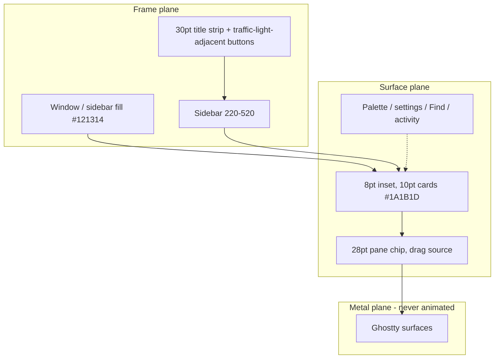

# feat: Align F7TTY UI with native Unpeel

## Goal Capsule

Objective: A daily F7TTY session feels like current native Unpeel until the user hits a product surface F7TTY does not have.

Means: Restyle F7TTY’s existing AppKit workspace to Unpeel’s live Mac chrome (inset cards, frame/surface hierarchy, Phosphor icons, pane chips, sidebar resize, chrome motion) without adding Unpeel product features (KD1, KD5).

Authority: Product Contract > Planning Contract > Implementation Units. Unpeel live native code under `clients/native/UnpeelNative` is the visual reference, not `DESIGN.md`.

Stop: F7TTY name, logo, and copy remain. No agent, worktree, MCP, pairing, transcript, preset, or archive surfaces. Ghostty pane geometry stays instant.

Execution profile: Smoke-first on chrome and panes, then unit tests for hit-testing and appearance contracts that this work will change.

## Product Contract

### Summary

F7TTY already hosts Ghostty workspaces with splits, a sidebar, settings, palette, Find, and activity. It looks like an older Unpeel generation: full-bleed black terminals, fixed 300pt sidebar, SF Symbol header toolbar, animations disabled. This work restyles that existing workspace so using it feels like the current native Unpeel Mac app, while F7TTY stays F7TTY.

### Problem Frame

The owner now has Unpeel source. F7TTY’s README already disclaims Unpeel parity, yet the chrome was aimed at an older shell. Sitting the two apps side by side, F7TTY reads as a different product: flatter hierarchy, painted titlebar controls, no chrome motion, Menlo on black.

### Requirements

- R1. The window, sidebar, and terminal cards use Unpeel’s current spatial language: near-black frame below slightly lighter surface cards, 8pt inset, 10pt continuous card corners, compact title strip.
- R2. Existing capabilities use Unpeel’s interactions: compact pane chip (drag to split or reorder), resizable sidebar 220–520 (default 300), Phosphor chrome icons, painted selected-row highlight (hover ~10%, selected ~16%, radius 9), chrome motion on sidebar and overlays. Liquid Glass selected chips are a non-goal at 100% opacity (KTD2).
- R3. Keyboard splits, zoom, sidebar toggle, palette, Find, and settings keep working. Header split/zoom/ellipsis buttons go away because Unpeel does not show them.
- R4. F7TTY keeps its name, FunnySoft logo, and copy. Empty and settings use Unpeel type and tokens with F7TTY marks. About stays the existing branded alert.
- R5. Palette, settings, Find, and activity share the token system and feel like the same product. They do not need pixel-identical Unpeel overlay chrome.
- R6. The terminal canvas the user stares at matches Unpeel’s surface and mono stack (not F7TTY’s current black Menlo).
- R7. Translucent chrome, when the user lowers opacity, uses Unpeel’s within-window glass, not behind-window blur. Default stays fully opaque.
- R8. Ghostty/Metal pane geometry never interpolates. Chrome may animate (sidebar clip-slide, accordion, overlays). When sidebar width or collapse would change a Ghostty frame, apply that frame jump inside `CATransaction.setDisableActions(true)` so Metal snaps while chrome slides.
- R9. Reduce-motion disables stagger, row-enter, folder accordion, overlay present/dismiss, and non-drag sidebar motion. Hover color may still change without duration.
- R10. No Unpeel product surfaces: agents, worktrees, MCP, pairing, transcripts, presets, archive library, workspace-dot carousel as navigation.

### Actors

- A1. João using F7TTY as a local Ghostty workspace preview on Apple Silicon macOS 14+.

### Key Flows

- F1. Open F7TTY, pick a session, type in a terminal. Chrome and canvas should feel like Unpeel.
- F2. Expand/collapse a folder, resize the sidebar, hover rows, select a session.
- F3. Split and rearrange panes by dragging the pane chip. Same outcomes as today’s model via keyboard (Command-D, Command-Shift-D, maximize).
- F4. Command-B sidebar, Command-K palette, Command-F Find, Command-comma settings, activity bell. Overlays share the system without cloning every Unpeel overlay detail.
- F5. Lower background opacity, then return to 100%. Glass appears only while lowered. Terminals stay opaque.

### Acceptance Examples

- AE1. Covers F1 / R1 / R6. Two windows side by side (F7TTY and Unpeel): frame is darker than the terminal card, cards sit inset (8pt top/trailing/bottom; leading 0 while the sidebar is open), title strip is compact, canvas is Unpeel surface not black. Judge hierarchy and canvas, not Liquid Glass material.
- AE2. Covers F3 / R2 / R3. Dragging the pane chip to an edge nests a split. Command-D still splits right. No split/zoom/ellipsis buttons in the header.
- AE3. Covers F2 / R2 / R8 / R9. Folder expand uses Unpeel accordion timing. Reduce-motion makes it instant. Live terminals do not tween size while the sidebar width is dragged.
- AE4. Covers F5 / R7. Opacity 70% shows within-window glass. Opacity 100% is opaque with no blur view attached.
- AE5. Covers R4 / R10. Empty state still says F7TTY and shows the FunnySoft mark. No worktree, MCP, or pairing chrome.

### Success Criteria

A session in F7TTY matches Unpeel’s opaque spatial language, canvas, Phosphor chrome, pane chips, and chrome motion until a missing product feature. Unpeel’s Liquid Glass selected chip and ~40% glass default are non-goals (KTD2, KTD6). Overlay pixel-perfection is not the bar.

### Scope Boundaries

In scope: tokens, window chrome, sidebar, pane chips, terminal canvas/font, chrome motion, Phosphor icons, restyling existing overlays.

Out of scope: Unpeel product surfaces (R10), SwiftUI rewrite, rebranding, copying Unpeel’s mascot, pixel-cloning every overlay.

Deferred to Follow-Up Work: GPU measurement of the restyled opaque path (README already marks GPU comparisons as pending owner go-ahead).

### Key Decisions

- KD1. Match current native Unpeel, not `DESIGN.md` or a tokens-only pass. (session-settled: user-directed — chosen over DESIGN.md glass and quieter motion: the live Mac app is the target, including chrome motion.) Governs R1, R2, R6.
- KD2. Unpeel interactions replace F7TTY’s on capabilities that already exist. (session-settled: user-directed — chosen over restyle-only and keep pane toolbar: daily-driver feel needs Unpeel’s controls.) Governs R2, R3.
- KD3. Pass bar is daily-driver indistinguishability, looser on overlay pixels. (session-settled: user-directed — chosen over chrome-match and shell-only.) Governs R5.
- KD4. F7TTY keeps name, logo, and copy. (session-settled: user-approved — chosen over cloning Unpeel brand: Unpeel supplies the visual system, not the identity.) Governs R4.
- KD5. No new product features. Governs R10.

### Sources

- Unpeel native SSOT: `Theme.swift`, `SidebarView.swift` (`SidebarMotion`), `Chrome.swift`, `RootView.swift`, `AppDelegate.swift`, `ChromeIcons.swift`, `TerminalPaneView.swift` under Unpeel `clients/native/UnpeelNative`.
- F7TTY chrome: `Sources/F7TTY/main.swift`, `AppearancePanel.swift`, `WorkspaceColor.swift`, `CommandPaletteView.swift`, `TerminalSearchBar.swift`, `TerminalActivity.swift`, `AppearanceSettingsView.swift`.
- Grounding: `/tmp/compound-engineering-501/ce-brainstorm/f7tty-unpeel-ui/grounding.md`.

## Planning Contract

### Key Technical Decisions

- KTD1. Stay on AppKit. Do not rewrite chrome in SwiftUI. Unpeel’s SwiftUI is the visual spec; F7TTY ports look and motion into existing AppKit views. Rationale: a SwiftUI host would be a product rewrite, not a restyle.
- KTD2. At 100% opacity, selected rows and cards use painted Unpeel highlight (foreground ~10% hover, ~16% selected, radius 9), not `NSVisualEffectView`. True glass is only the window-level within-window hud material while opacity is below 100%. (conflict call-out: Unpeel’s Liquid Glass selected chip at opaque 100% cannot coexist with F7TTY’s measured opaque composition path; painted glass is the workable stand-in.) Governs R7.
- KTD3. Sidebar 220–520 uses a custom invisible handle on the existing zero-thickness `WorkspaceSplitView`, not a visible split divider. Rationale: `testWorkspaceChromeHasNoDividerButPaneSplitsRemainResizable` locks chrome divider at 0.
- KTD4. Chrome icons are vendored Phosphor-style glass SVGs (template-tinted), loaded instead of `systemSymbolName`. FunnySoft logo stays the existing SVG. Tool/session glyph in the pane chip may stay a simple terminal mark.
- KTD5. Chrome motion uses `NSAnimationContext` / `CAMediaTimingFunction` with Unpeel curves. Non-drag sidebar collapse clip-slides the sidebar; Ghostty/canvas width jumps inside `CATransaction.setDisableActions(true)`. Live sidebar-width drag, pane reparent, and zoom also disable implicit actions. Governs R8, R9.
- KTD6. Default `backgroundOpacity` remains 1. Unpeel’s ~40% glass default is not adopted. (assumption from LFG call-out default.) Governs R7.
- KTD7. Terminal theme: canvas `#1A1B1D` dark / white light, JetBrains Mono then SF Mono, 13pt, padding 0. Bundle JetBrains Mono if the OFL font can be vendored cleanly; otherwise SF Mono. Governs R6.

### High-Level Technical Design



Motion is allowed on frame and overlay chrome. Any constraint that changes a Ghostty view’s frame is applied inside a disabled-actions transaction.

Unpeel timings to port (chrome only):

| Motion | Timing |
| --- | --- |
| Hover | 0.12s ease |
| Sidebar width (non-drag) | 0.15s cubic(0.25, 0.1, 0.25, 1) |
| Accordion open | 340ms cubic(0.16, 1, 0.3, 1) |
| Accordion close | 240ms cubic(0.65, 0, 0.35, 1) |
| Row enter | 380ms cubic(0.18, 0.86, 0.26, 1), stagger 14ms |
| Overlay present | ~150–200ms ease-out |

### Assumptions

- A-1. Opaque default (KTD6) unless the owner later asks for Unpeel’s glass default.
- A-2. SF Mono is an acceptable JetBrains fallback if bundling the font is heavier than the restyle.
- A-3. macOS 26 Liquid Glass APIs are not required. Painted highlight plus optional within-window material is enough for daily-driver feel on macOS 14+.
- A-4. Keyboard chord set stays F7TTY’s current map even when Unpeel uses different chords for the same action.

### Implementation Constraints

- Do not animate Ghostty frames.
- Do not attach behind-window blur. Do not leave a blur view attached at 100% opacity.
- Do not add a visible chrome split divider.
- Hit-testing: pane chip is the drag source; leftover header padding must not swallow clicks the way today’s full-width header does. Buttons stay out of the key view loop and accept first mouse.
- Sidebar hover plus/remove positions are frame-relative; update tests that hard-code 284-wide rows.
- Appearance tests that lock dark fill `< 0.2` must be updated to Unpeel frame/surface values.

### Sequencing

U1 tokens → U2 window/cards → U3 sidebar → U4 pane chips → U5 terminal canvas → U6 overlays → U7 motion polish. U7 may land motion hooks inside U3/U6 if cheaper, but verification of reduce-motion and no-Metal-tween is U7’s gate.

### Research

F7TTY chrome is concentrated in `Sources/F7TTY/main.swift`. Unpeel `DESIGN.md` is a 2026-06 Svelte extraction and is not SSOT. Native Unpeel frame `#121314`, surface `#1A1B1D`, inset 8, radius 10, sidebar 300/220/520, row 28, title strip 30. F7TTY currently: window min 650×400, sidebar fixed 300, terminals `#000000` Menlo 13, blur `.underWindowBackground` / `.behindWindow`, `CATransaction.setDisableActions` on pane reparent only.

## Implementation Units

### U1. Unpeel tokens in AppKit

**Goal:** One appearance source for frame, surface, text, hover, selected, danger, radii, and layout constants.

**Requirements:** R1, R6

**Dependencies:** none

**Files:**
- Create `Sources/F7TTY/Theme.swift` (or equivalent name next to `WorkspaceColor.swift`)
- Modify `Sources/F7TTY/WorkspaceColor.swift`
- Modify `Sources/F7TTY/AppearancePanel.swift`
- Modify `Tests/F7TTYTests/WorkspaceModelTests.swift` (appearance fill contracts)

**Approach:**
1. Port Unpeel’s resolved dark/light neutrals and layout numbers into AppKit dynamic colors and `CGFloat` constants.
2. Map existing workspace hues onto Unpeel’s tint wash so Default is `#121314` / `#1A1B1D`, not today’s `#101214` / charcoal.
3. Point `AppearancePanel` fills at those tokens. Do not scatter new literals in `main.swift`.

**Patterns to follow:** `WorkspaceColor.swift` hue cases; Unpeel `Theme.swift` token table.

**Test scenarios:**
- Dark Default frame is near `#121314` and surface is near `#1A1B1D` (not black, not the old 0.064 sidebar).
- Light Default surface is near white and text is near `#111217`.
- Non-default workspace hues still read as a wash on the same hierarchy (frame darker than surface).
- `fillOpacity` still multiplies layer alpha.

**Verification:** `swift test` appearance cases in `WorkspaceModelTests.swift`.

**Execution note:** Update the existing dark-fill `< 0.2` assertions in the same change so CI does not lock the old charcoal.

### U2. Window frame, inset cards, title strip

**Goal:** Unpeel’s card-on-frame window, including collapsed-sidebar gutters and min size.

**Requirements:** R1, R4, R7

**Dependencies:** U1

**Files:**
- Modify `Sources/F7TTY/main.swift` (`buildWindow`, canvas/empty/settings constraints, sidebar toggle margins)
- Modify `Tests/F7TTYTests/WorkspaceModelTests.swift` if margin/smoke contracts live there; otherwise smoke in `runSmokeTest`

**Approach:**
1. Window min size 800×600. Hidden title stays. Title string can remain F7TTY for the Window menu, not a painted 38pt bar.
2. Cards use 10pt continuous corners. Inset 8pt on top, trailing, and bottom. Leading inset is 0 while the sidebar is visible (sidebar is the left frame) and 8pt when it is collapsed. Keep today’s expanded leading 0.
3. Compact ~30pt strip for sidebar toggle and activity, offset near traffic lights (Unpeel uses ~80,5 not 86,4).
4. Empty card uses the same inset/radius as terminal cards.
5. Own R7: `applyBackgroundOpacity` uses within-window HUD material below 100% opacity and detaches the blur view at 100%. Never `.behindWindow`.

**Patterns to follow:** Unpeel `RootView` 8pt inset; F7TTY `AppearancePanel` cards.

**Test scenarios:**
- Sidebar visible: canvas leading inset is 0, top/trailing/bottom are 8pt.
- Sidebar hidden: leading inset becomes 8pt (frame gutter around the card).
- Empty workspace card matches terminal card radius 10 and hairline.
- Window `minSize` is 800×600.
- Opacity 70% attaches within-window HUD material. Opacity 100% removes the blur view and the window is opaque.

**Verification:** Unit constraints where they exist; `--smoke-test` sidebar margin checks updated to the new insets.

### U3. Sidebar resize, rows, Phosphor, selection

**Goal:** Sidebar feels like Unpeel’s list: width, rows, icons, highlight, folder accordion.

**Requirements:** R2, R4, R8, KTD2, KTD3, KTD4

**Dependencies:** U1, U2

**Files:**
- Modify `Sources/F7TTY/main.swift` (`WorkspaceSplitView`, `SidebarRowButton`, `configureSidebar`, width constraint)
- Add Phosphor SVG resources under `Sources/F7TTY/Resources/`
- Modify `Tests/F7TTYTests/WorkspaceModelTests.swift` (row hit-testing, chrome divider)

**Approach:**
1. Replace the 300pt equality constraint with default 300, min 220, max 520, persisted in UserDefaults (not workspace-state.json). Invisible drag handle with resize cursor and accessibility label. Chrome divider thickness stays 0. Drop the existing `canvas.widthAnchor >= 300` so an 800pt window can hold a 520pt sidebar.
2. Project/folder: 13pt medium @ 0.6. Session: 13pt regular. Row minHeight 28, radius 9, indent 14.
3. Selected row: painted Unpeel active tint, no stroke-as-outline unless Unpeel uses a hairline. Hover fg 10%.
4. Swap SF Symbols for Phosphor glass template images on sidebar, footer, and title-strip buttons. Keep accessibility labels matching the old button names. Keep FunnySoft logo.
5. Keep session rows mounted across folder expand/collapse. Animate the session-list container height (Unpeel 340ms open / 240ms close). Full `refreshSidebar()` rebuilds are for structural model changes only, not accordion toggles. Do not introduce Unpeel workspace dots.

**Patterns to follow:** `SidebarRowButton` painting; Unpeel `SidebarView` row geometry; existing drop-into-folder highlight.

**Test scenarios:**
- Sidebar width can be set to 220 and 520 and rejects outside that range.
- Default width remains 300.
- Chrome divider thickness is still 0. Pane split divider stays 8.
- Folder hover-add and session hover-remove still hit at the trailing control after width changes (not hard-coded 284).
- Selected row has no 0.23 white stroke unless the Unpeel recipe includes it.
- Phosphor (or template SVG) is used for sidebar.left / folder / terminal chrome, not `systemSymbolName` for those controls.

**Verification:** `swift test` hit-testing and chrome-divider tests; manual `--ui-preview` row hover.

**Execution note:** Live width drag resizes Metal panes the same way split dividers do. Disable implicit layer actions around constraint updates.

### U4. Pane chips instead of header toolbar

**Goal:** Splits and zoom work the Unpeel way on screen, F7TTY way on the keyboard.

**Requirements:** R2, R3, R8, KD2

**Dependencies:** U2

**Files:**
- Modify `Sources/F7TTY/main.swift` (`Pane`, `PaneHeaderView`, `PaneContainerView`, `ActionButton` usage)
- Modify `Tests/F7TTYTests/WorkspaceModelTests.swift` (header hit-test, drop zones)

**Approach:**
1. Remove split-right, split-below, zoom, and ellipsis from the pane header.
2. Replace with a compact title chip (~22×7 padding, 13pt, terminal mark). Title is display only (no double-click rename; session/workspace rename stays in the sidebar).
3. Drag source is the chip, not the full header. Keep existing pasteboard type and `WorkspaceSession.move` zones (edge nest, center swap). Chip states: default, hover, dragging, edge drop-target, center drop-target.
4. Context menu on the chip: Split right, Split below, Toggle zoom, Close pane. Close session stays on the sidebar. Accessibility title on the chip.
5. Command-D, Command-Shift-D, maximize, directional focus unchanged.

**Patterns to follow:** Existing `PaneHeaderView` drag session and `PaneContainerView` 25% edge zones; Unpeel `TerminalPaneView` chip.

**Test scenarios:**
- Header no longer contains split/zoom/ellipsis `ActionButton`s.
- Chip drag to a pane edge still nests a split and preserves terminal IDs.
- Center drop still swaps.
- Escape during drag leaves the model unchanged.
- Command-D splits right without the button.
- Chip context menu still exposes close pane and toggle zoom.
- Maximize still toggles via the existing shortcut/menu.
- Buttons (if any remain) are not first responders and accept first mouse.
- Clicking the selected session does not rebuild the pane tree.

**Verification:** Existing pane-drop and header hit-test tests, rewritten around the chip.

### U5. Terminal canvas and mono

**Goal:** The grid matches Unpeel’s surface, not black Menlo.

**Requirements:** R6, KTD7

**Dependencies:** U1

**Files:**
- Modify `Sources/F7TTY/Resources/terminal.conf`
- Modify `Sources/F7TTY/main.swift` (`Pane` container fill, session configuration)
- Optionally add a bundled mono font under Resources
- Modify `Tests/F7TTYTests/TerminalRenderingTests.swift` only if it asserts background/font

**Approach:**
1. Dark canvas `#1A1B1D` (tinted surface when a workspace color is active). Light canvas white.
2. Font: JetBrains Mono if vendored, else SF Mono, 13pt, padding 0.
3. Pane container fill matches the Ghostty canvas so rounded corners do not flash black.
4. Keep terminals independently themed for contrast in Light chrome, using Unpeel’s light terminal table when appearance is light.

**Patterns to follow:** Current `terminal.conf` as the only Ghostty config the host loads; Unpeel ANSI table in `Theme.swift`.

**Test scenarios:**
- Dark pane container is not `NSColor.black`; it matches the configured canvas.
- `terminal.conf` background is `#1A1B1D` (or the token hex), font is the chosen mono, padding 0.
- Light appearance does not leave a black terminal card.

**Verification:** Config assertions plus `--smoke-test` flush-under-header check (still flush, new color).

### U6. Overlay restyle

**Goal:** Palette, settings, Find, activity, and empty state share the token system without pixel-cloning Unpeel.

**Requirements:** R4, R5, R10

**Dependencies:** U1, U2

**Files:**
- Modify `Sources/F7TTY/CommandPaletteView.swift`
- Modify `Sources/F7TTY/AppearanceSettingsView.swift`
- Modify `Sources/F7TTY/TerminalSearchBar.swift`
- Modify `Sources/F7TTY/TerminalActivity.swift`
- Modify `Sources/F7TTY/main.swift` (empty state)

**Approach:**
1. Cards: radius ~16 palette, ~8 Find, settings as inset surface card. Tokens from U1. 13–16pt type per Unpeel overlay scale where cheap.
2. Empty state: F7TTY logo, Unpeel type scale (14 muted title, smaller hint and version). No Unpeel mascot.
3. Settings copy stays F7TTY. Restyle the current settings host with U1 tokens, type, and radii only. Do not add Unpeel’s sidebar-slide settings stack.
4. Activity popover: Unpeel-ish row height and tokens; keep F7TTY’s bell-event semantics.

**Patterns to follow:** Existing overlay hosts; Unpeel `CommandPaletteView` as feel reference only.

**Test scenarios:**
- Palette still filters and activates; card uses theme surface, not the old 0.105 charcoal literal.
- Find still navigates matches; controls stay ≥20pt in narrow panes.
- Empty state string still identifies F7TTY and shows `Brand.image()`.
- Settings still occludes terminals without destroying them.
- No worktree/MCP/pairing controls appear.

**Verification:** Existing palette/find/activity unit tests plus empty-state smoke.

**Execution note:** Daily-driver feel over pixel match. Stop overlay polish when tokens, type, and radii read as the same product.

### U7. Chrome motion and reduce-motion

**Goal:** Unpeel’s motion catalog on chrome, zero interpolation on Metal.

**Requirements:** R2, R8, R9, KTD5

**Dependencies:** U3, U4, U6

**Files:**
- Modify `Sources/F7TTY/main.swift` (sidebar toggle, folder expand, overlay present/dismiss)
- Possibly a small `Sources/F7TTY/ChromeMotion.swift` for shared curves

**Approach:**
1. Centralize Unpeel timing functions. Honor `NSWorkspace.shared.accessibilityDisplayShouldReduceMotion`.
2. Animate chrome only: folder accordion (U3’s mounted rows), row hover (0.12s), overlay fade. Non-drag sidebar collapse clip-slides the sidebar; Ghostty/canvas width snaps under disable-actions.
3. Every path that changes a Ghostty frame (sidebar width, pane reparent, zoom) keeps `setDisableActions(true)`. No documenting-as-smoke hatch.
4. Do not animate settings content swap or in-session pane geometry. Reduce-motion zeros accordion, overlay present/dismiss, row-enter stagger, and non-drag sidebar motion.

**Patterns to follow:** Existing disable-actions reparent; Unpeel `SidebarMotion`.

**Test scenarios:**
- Reduce-motion: folder expand, overlay present/dismiss, and non-drag sidebar motion have no duration (or ~0). Row-enter stagger is skipped.
- Sidebar toggle does not rebuild `paneTreeView` and does not leave the terminal without first responder.
- Sidebar width, pane reparent, and zoom apply Ghostty frames inside `CATransaction.setDisableActions(true)`.
- Hover/selection color changes do not move Metal surfaces.

**Verification:** `--smoke-test` sidebar toggle identity; `--ui-preview` accordion with and without reduce-motion. Full animation acceptance is still an attended pass (README already says so).

## Verification Contract

Repo commands (from README Checks):

```sh
python3 dependency-bootstrap.py
swift test
swift build -c release --product F7TTY
.build/release/F7TTY --smoke-test
```

If XCTest is unavailable, run the standalone save-scheduler tests already documented; chrome tests in `WorkspaceModelTests.swift` need XCTest.

Attended: `python3 build-app.py --output dist/F7TTY-Polish.app` then `--ui-preview` and `--empty-preview`. Compare beside Unpeel for AE1.

Do not treat GPU samples as proof of this restyle. Do not enable `--legacy-composition`.

## Definition of Done

Global:
- AE1–AE5 hold on a local preview next to Unpeel.
- R10: no new product surfaces in the diff.
- Ghostty frames do not tween. Blur view absent at 100% opacity.
- F7TTY brand strings and `Brand.image()` remain.
- Abandoned experiment code (square-pane forks, leftover SF Symbol buttons, old charcoal literals in restyled surfaces) is removed.
- Tests that encoded the old chrome contracts are updated, not skipped.

Per unit: U1 tokens in use; U2 inset cards; U3 resizable Phosphor sidebar; U4 chip-drag + keyboard; U5 canvas/mono; U6 overlays on tokens; U7 motion + reduce-motion.

## System-Wide Impact

Users of the development bundle see a new visual system and lose on-pane split buttons (keyboard and menus remain). Persistence gains optional sidebar width. Smoke and appearance tests must move with the tokens. No protocol, save-schema, or GhosttyKit pin change except font/theme in `terminal.conf`.
